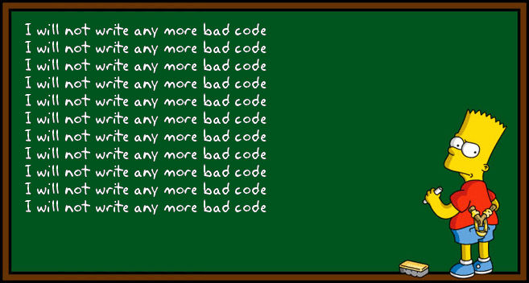

## ماهو مبدأ DRY - Don't Repeat Yourself (لا تقم بتكرار نفسك)?

إذا كان صديقك أمامك ويخبرك أنه ذهب إلى إيطاليا, أول مرة ستسمع له وتسأله حول كيف كانت رحلته.

تخيل أن صديقك أخبرك مرة أخرى أنه ذهب إلى إيطاليا.

لم ينتهي الأمر هنا, بل أخبرك خمس مرات وأنت أصبحت تشعر بالملل. وإذا بإمكانك أن تهرب منه ستقوم بذلك بأسرع وقت :smile:

هذا ما يحصل معك صديقي المبرمج... حينما تكتب كود خمس مرات, ويقرأه مبرمج آخر, سيشعر بالملل بالتأكيد!

## أين قمنا بخرق هذا المبدأ؟

لاحظ معي هذا الكود, هل يوجد فيه أي تكرار:

```
def withdraw(self, request):
    # allowed papers: 100, 50, 10, 5, and cents
    print("Current balance = ", self.balance)
    result = self.balance
    
    if request > self.balance:
        print("Can't give you all this money !!")
        
    elif request < 0:
        print("More than zero plz!")
        
    else:
        self.withdrawals_list.append(request)
        self.balance -= request
    
        while request > 0:
    
            if request >= 100:
                request -= 100
                print("give 100")

            elif request >= 50:
                request -= 50
                print("give 50")
    
            elif request >= 10:
                request -= 10
                print("give 10")
    
            elif request >= 5:
                request -= 5
                print("give 5")

            elif request < 5:
              print("give " + str(request))
              request = 0
```

أعتقد أنك رأيته, نحن قمنا بتكرار هذا الأوامر خمس مرات بأرقام مختلفة:

```
if request >= 100:
    request -= 100
    print("give 100")
    
elif request >= 50:
    request -= 50
    print("give 50")

elif request >= 10:
    request -= 10
    print("give 10")

elif request >= 5:
    request -= 5
    print("give 5")

elif request < 5:
  print("give " + str(request))
  request = 0
```

## هل سنقوم بعمل دالة للتخلص من التكرار؟

لا, هناك حل أنسب باستعمال القوائم (lists)

نعرف أولاً قائمة الأوراق المتاحة:

```
notes = [100, 50, 10, 5]
```

ثم نقوم بالمرور عليها:


```
for note in notes:
    if request >= note:
        request -= note
        print("give ", str(note))
```

بهذا الشكل نحن نمر على كل الأوراق بدون أي تكرار, ليصبح لدينا الكود بهذا الشكل:

```
def withdraw(self, request):
    # allowed papers: 100, 50, 10, 5, and cents
    print("Current balance = ", self.balance)
    result = self.balance

    if request > self.balance:
        print("Can't give you all this money !!")

    elif request < 0:
        print("More than zero plz!")

    else:
        self.withdrawals_list.append(request)
        self.balance -= request

        notes = [100, 50, 10, 5]
        for note in notes:
            while request >= note:
                request -= note
                print("give ", str(note))
```

## بقي آخر شرط

لاحظ معي أن الحل بالأعلى لا يقوم بالتعامل مع شرط إعطاء آخر مبلغ

```
elif request < 5:
  print("give " + str(request))
  request = 0
```

سأترك لك هذا الجزء لتحله بنفسك :wink:


* [مصدر الصورة](https://hackernoon.com/this-is-not-the-dry-you-are-looking-for-a316ed3f445f)