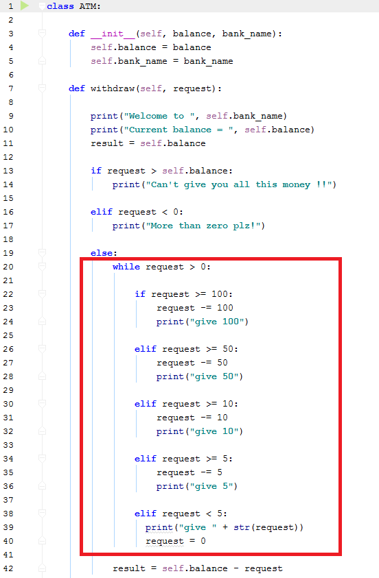

## هل يوجد مشكلة في هذا الكود (المحدد) ؟

## نعم يوجد مشكلة, الكود لا يتبع مبدأ مهمة واحدة لكل دالة (Single Responsibility Principle - SRP)

الدالة السابقة تقوم بالعديد من الأمور:

1. طباعة اسم البنك والرصيد المتبقي

2. التحقق من صحة الطلب request (إذا كان أكبر من الرصيد المتاح)

3. سحب الأموال من الرصيد بالخوارزمية التي كتبناها

## مالذي يخبرنا به المبرمج المخضرم Uncle Bob حول SRP ?

تخيل معي هذا السيناريو:

> تذهب إلى محل صيانة السيارات, تخبر الشخص أنك تريد إصلاح كرسي السيارة, ترجع للمحل وقد أصلح لك الكرسي... ولكن حينما تشغل السيارة تكتشف أن المقود معطل !

هل ستذهب إلى نفس محل صيانة السيارات مرة أخرى ؟

مستحيل, أنت لا تريد أن تكون مثل شخص الصيانة هذا... لذا حاول أن تكتب الدوال خاصتك لكل واحدة مهمة واحدة لكي لا تقوم بتعديل أي دالة وتعطل أحد الخصائص فيها.

## مصادر

https://www.youtube.com/watch?v=t86v3N4OshQ

