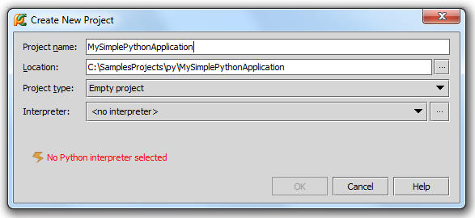

## سهولة PyCharm

تشغيل أكواد بايثون داخل PyCharm سهل جداً جداً وهو ما يجعل البرنامج يتفوق على بقية البرامج.

## في حال واجهتك مشكلة أثناء عمل Create

راجع جزئية تنصيب البايثون وربطها مع PATH في الدرس السابق (المشاكل الشائعة في PyCharm).