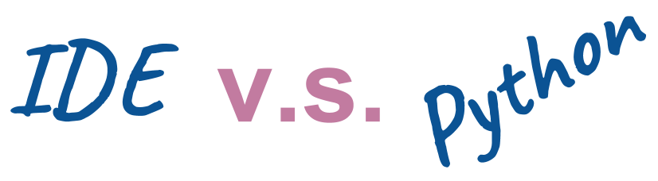
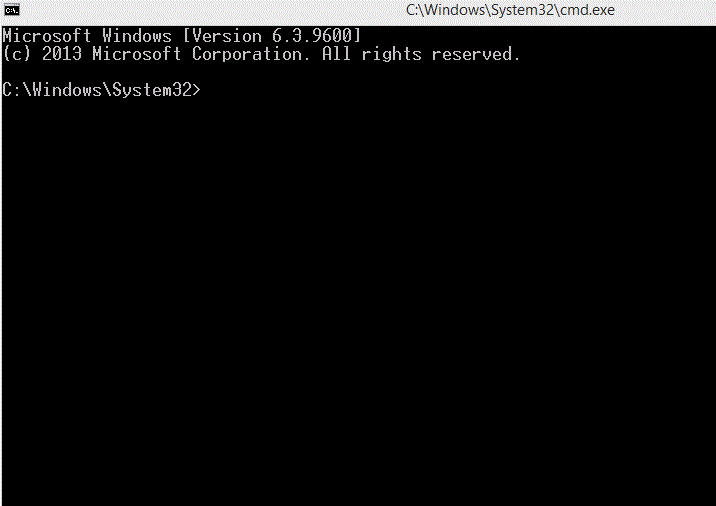

استعملنا حتى الآن كلاً من Python و IDE.

### ولكن ماهو الـ IDE (Integrated Development Environment) ؟

الـ IDE هو بيئة تطوير متكاملة تكتب عليها الكود وتشغله وتقوم بتصحيحه.

استعملنا PyCharm وهو يعتبر IDE ممتاز للبايثون.

### هل VSCode يعتبر IDE ؟

لا, VSCode هو محرر أكواد Code Editor (ليس مخصص للبايثون فقط), ولكنه يدعم اضافات لتشغيل أكواد بايثون بشكل سلس.

### ماهو الفرق بين IDE و Python ؟

حينما قمنا بتحميل بايثون, فنحن نحمل فقط مفسر اللغة أو ما يعرف بالـ interpreter.

بمعنى حينما تكتب على ملف `main.py` الجملة `print('hello')` فإن مفسر بايثون يقوم بفهمها وطباعة جملة hello على الشاشة.

مفسر بايثون interpreter هو ما يظهر عندما نكتب في موجه الأوامر (cmd) الأمر python.

